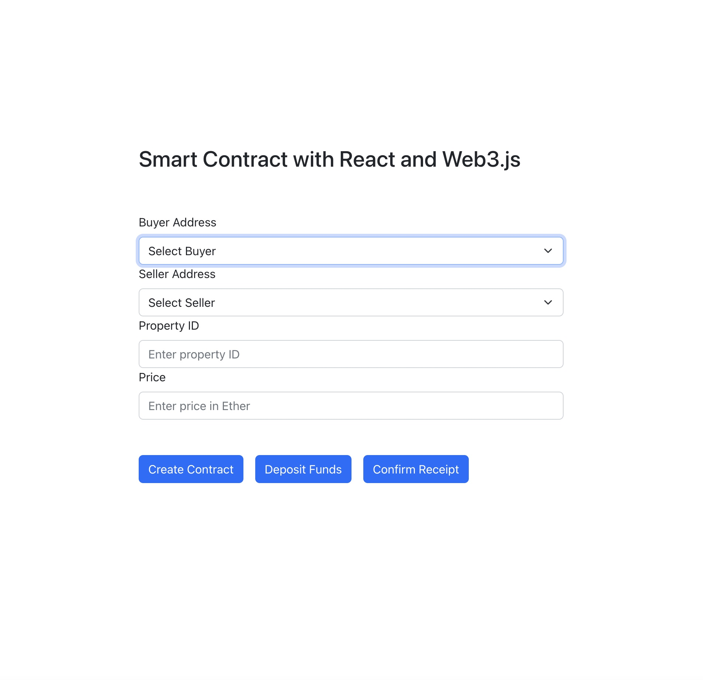

# FintechProject3

## Problem Statement

- The current real estate contractual process is costly and time consuming.
- It is difficult to validate integral documents related to the sale of a home.
- Can be risky and expensive due to the limitations of human processing.
- A home buyer may not recieve the complete product that was initially discussed.
- Qualification for loans takes too much time.

---

## Solution Overview

Block chain aims to streamline home sale processes, facilitating property transfers between owners and buyers without the need for a third party. This reduces costs and speeds up the time consuming process of property transfers and real estate investment. This would allow users to hold application information on the chain, securely and efficiently. Which would be verified by asset holders to ensure integrity. In addition, asset holders can easily be identified for banks and other lenders to allow efficient loan processing.

---

## Technology Stack

### Blockchain Technologies

- Ethereum - Ethereum is a decentralized, open-source blockchain with smart contract functionality.
- Solidity - Solidity is a statically-typed curly-braces programming language designed for developing smart contracts that run on Ethereum.
- Remix IDE - Remix IDE is an open-source, browser based tool that allows developers to create and test smart contracts using Solidity.
- Ganache - Ganache allows you to fire up a personal Ethereum blockchain which you can use to run tests, execute commands, and inspect state while controlling how the chain operates.
- Streamlit - Streamlit is a Python-based framework for building and deploying data-centric web applications.
- Python - Python is a widely adopted programming language that has many uses, including artificial intelligence, machine learning and web application development.

---

## Installation

The project's dependencies are stored in `requirements.txt`. To install these dependencies, you can execute the following command:

`pip install -r requirements.txt`

---

## Usage

### Running the Code

To run the code, perform the following steps:

NOTE: Prior to running program ensure you have installed the required dependancies listed above.

1. Open Ganache
   1. Select "Quickstart Ethereum"
2. Open Gitbash
   1. Navigate to Project Folder
3. Execute `streamlit run app.py`
   1. Enter Buyer Address
   2. Enter Seller Address
   3. Enter Property ID
   4. Enter Price (in ETH)
4. Click "Create Contract"
5. Click "Deposit Funds"

---

## Incorporation of New Technologies

As part of the requirements for this project, we are to consider new technologies that have not been covered in class. One challenge that we have faced in this class is the use of Streamlit in developing rich, interactive web applications. Developing with Streamlit has many challenges, including a paradigm and language that is not familiar to many web developers.
  
Web developers are used to developing using HTML, CSS and Javascript. HTML allows developers to easily control the layout of an application. CSS provides the ability to control styles, such as spacing, font sizes and colors. JavaScript is the glue that provides functionality for the application itself, enabling an application to come to life.  
  
ReactJS is a powerful, open-source framework for developing web applications that builds on the paradigms set forth by HTML, CSS and Javascript. Rather than being page-centric, React allows developers to build single page, desktop-like applications within the context of a browser.  
  
We have ported over the front-end user interface for our Streamlit-based application to React and Web3.js. To see this application in action, do the following:
  

1. Launch Ganache.
2. Install required packages by executing the following command: `npm install`.
3. Start the application: `npm start`.
     
   

---

## Contributors

This application was authored by:

- Leo Khodel
- Kristen Potter (kristendmr@msn.com)
- Quinn Wong (quinn.wong@gmail.com)
- Sterling Davis
- Liz Panza

---

## License

The MIT License (MIT)

Permission is hereby granted, free of charge, to any person obtaining a copy of this software and associated documentation files (the "Software"), to deal in the Software without restriction, including without limitation the rights to use, copy, modify, merge, publish, distribute, sublicense, and/or sell copies of the Software, and to permit persons to whom the Software is furnished to do so, subject to the following conditions:

The above copyright notice and this permission notice shall be included in all copies or substantial portions of the Software.

THE SOFTWARE IS PROVIDED "AS IS", WITHOUT WARRANTY OF ANY KIND, EXPRESS OR IMPLIED, INCLUDING BUT NOT LIMITED TO THE WARRANTIES OF MERCHANTABILITY, FITNESS FOR A PARTICULAR PURPOSE AND NONINFRINGEMENT. IN NO EVENT SHALL THE AUTHORS OR COPYRIGHT HOLDERS BE LIABLE FOR ANY CLAIM, DAMAGES OR OTHER LIABILITY, WHETHER IN AN ACTION OF CONTRACT, TORT OR OTHERWISE, ARISING FROM, OUT OF OR IN CONNECTION WITH THE SOFTWARE OR THE USE OR OTHER DEALINGS IN THE SOFTWARE.
